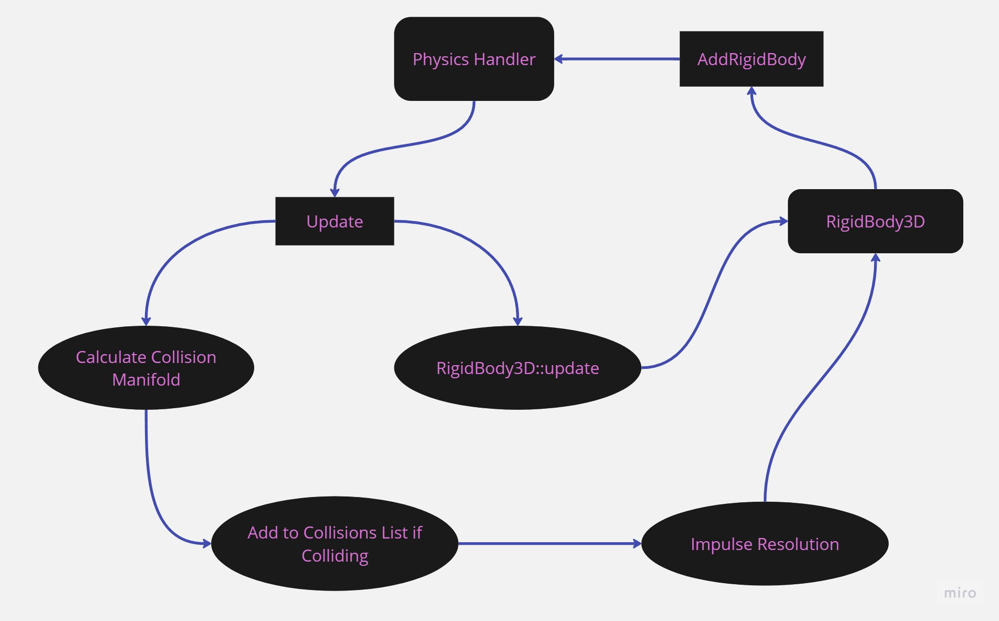
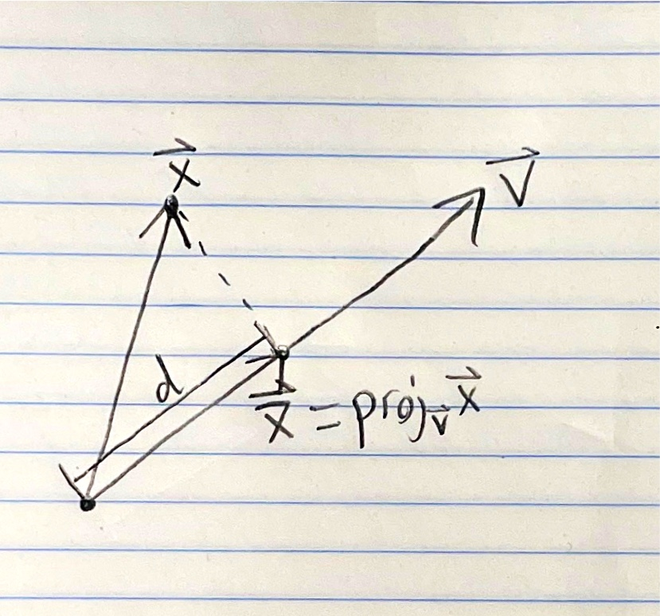

# Zeta Resources

* ### [About](https://github.com/Salamence064/Zeta-Resources#about-1)
* ### [The Zeta Codebase](https://github.com/Salamence064/Zeta-Resources#the-zeta-codebase-1)
* ### [Math for Zeta](https://github.com/Salamence064/Zeta-Resources#math-for-zeta-1)
* ### [Physics for Zeta](https://github.com/Salamence064/Zeta-Resources#physics-for-zeta-1)
* ### [Getting Started with Git and Github](https://github.com/Salamence064/Zeta-Resources#getting-started-with-git-and-github-1)
* ### [Contributors](https://github.com/Salamence064/Zeta-Resources#contributors-1)

___

## About
This document is meant to provide all the information someone new to Zeta would need to get started working with the engine. There are basics for math techniques, physics concepts, getting started with git and github, and a general introduction to working with our codebase. You do not need to read all of this but consider it a helpful resource for when you are unsure of how something in the engine works. If you have any questions reach out to Thomas or Utsawb (the PMs) on discord.

___

## The Zeta Codebase

* ##### [General Structure](https://github.com/Salamence064/Zeta-Resources#general-structure-1)
* ##### [ZMath](https://github.com/Salamence064/Zeta-Resources#zmath-1)
* ##### [Primitives](https://github.com/Salamence064/Zeta-Resources#primitives-1)
* ##### [Rigid and Static Bodies](https://github.com/Salamence064/Zeta-Resources#rigid-and-static-bodies-1)
* ##### [The Physics Handler](https://github.com/Salamence064/Zeta-Resources#the-physics-handler-1)
* ##### [Important Notes](https://github.com/Salamence064/Zeta-Resources#important-notes-1)
* ##### [2D Engine to Reference](https://github.com/Salamence064/Zeta-Resources#2d-engine-to-reference-1)

___

#### General Structure
* **6 Main Sections:**
  1. zmath.h
  2. primitives.h
  3. bodies.h
  4. intersections.h
  5. collisions.h
  6. physicshandler.h
<br>

* **Two Namespaces:**
  1. ZMath - contains all the math library code
  2. Zeta - contains all the physics related code
<br>

* **Coordinate System Used**
  * The origin is in the bottom left of the screen by default for Zeta
  * The position of primitives and rigid and static bodies is considered to be the centerpoint instead of the top left corner
  * Zeta will still work for any arbitrary coordinate system if the user provides a custom gravity value

Our engine works by accepting rigid and static bodies from the user in a physics handler. This physics handler then updates the positions, velocities, and net forces of those objects each frame for the user as depicted below. A codeblock example of a base implementation is also shown.

<br>



<br>

```c++
#include <ZETA/physicshandler.h>

int main() {
    // Create a physics handler with the default settings
    Zeta::Handler handler;

    // Create the colliders
    Zeta::Sphere* s1 = new Zeta::Sphere(ZMath::Vec3D(100.0f, 120.0f, 100.0f), 50.0f);
    Zeta::Sphere* s2 = new Zeta::Sphere(ZMath::Vec3D(350.0f, 500.0f, -340.0f), 200.0f);

    // Create some rigid bodies
    Zeta::RigidBody3D rb1(
        s1->c,                       // centerpoint
        50.0f,                       // mass
        0.9f,                        // coefficient of restitution
        0.975f,                      // linear damping
        Zeta::RIGID_SPHERE_COLLIDER, // collider type
        s1                           // collider
    );

    Zeta::RigidBody3D rb2(
        s2->c,                       // centerpoint
        100.0f,                      // mass
        0.95f,                       // coefficient of restitution
        0.8f,                        // linear damping
        Zeta::RIGID_SPHERE_COLLIDER, // collider type
        s2                           // collider
    );

    // Add the rigid bodies to the handler
    handler.addRigidBody(&rb1);
    handler.addRigidBody(&rb2);

    // Program's dt loop
    float dt = 0.0f;

    // Note: windowShouldNotClose would be replaced with the exit window condition in the user's graphics library
    while (windowShouldNotClose) {
        /* Rendering/Drawing code would go here */

        handler.update(dt); // The handler subtracts from dt for you
        // Note: getEllapsedTime() would be replaced with the equivalent in the user's graphics library
        dt += getEllapsedTime();
    }

    return 0;
};
```
___

#### ZMath

* **Math Library Created for Zeta**
<br>

* **5 Main Components:**
  1. Vec2D
      * Models a 2D vector
      * Used to force a constant z-value with planes
  2. Vec3D
     * Models a 3D vector
     * Used in almost every part of Zeta
     * Represents positions, distances, forces, and more
  3. Mat2D
     * Models a 2x2 matrix
     * Is not used in the codebase, but useful to know it exists if needed
  4. Mat3D
     * Models a 3x3 matrix
     * Mainly used to store rotation matrices
  5. Math Utils
     * compare - compares equality of two floats or vectors within a given tolerance
     * clamp - force a value or a vector between a min and a max
     * abs - take the absolute value of our custom classes
     * min - return the minimum of two values
     * max - return the maximum of two values
     * toRadians - convert an angle from degrees to radians
     * rotateXY - rotate a point with respect to the XY plane about an origin
     * rotateXZ - rotate a point with respect to the XZ plane about an origin
<br>

* **Floating Point Error**
  * Floats are imprecise
  * We handle this with a "tolerance"/"ɛ" value
  * If a value is within this tolerance/ɛ of another value, we consider them close enough to be equal

___

#### Primitives
* **Purpose of Primitives:**
  * Often we can represent simple objects as primitives in a physics engine
  * We can optimize collisions and computations for these specific types as we already know the type going in
<br>

* **6 Supported Primitives:**
  1. Ray3D
  2. Line3D
  3. Plane
  4. Sphere
  5. AABB (Unrotated Rectangular Prism)
  6. Cube (Rotated Rectangular Prism)
___

#### Rigid and Static Bodies
* **Rigid vs Static Bodies**
  * For a physics engine we represent objects as rigid or static bodies
  * A rigid body is an object that's affected by physics
  * A static body is one that is not
<br>

* **A Third Type**
  * A kinematic body is the third body used in a physics engine
  * Used to model a player
  * We plan to implement it this semester

___

#### The Physics Handler
* **What a Physics Handler Does:**
  * A physics handler takes care of all physics calculations for the user
  * It updates the rigid bodies based on these calculations
<br>

* **How to Use:**
  * The user creates the physics handler and can choose to pass in custom gravity and FPS values
  * The user then creates rigid and static bodies modeling objects in the program and passes them to the handler
  * Finally, the user calls the update function in the program's dt loop to perform the physics calculations
  * Example code can be seen in the [general structure section](https://github.com/Salamence064/Zeta-Resources#general-structure-1)

___

#### Important Notes
* **Efficiency is Top Priority:**
  * Since this is a physics engine, we want it to be as efficient as possible
  * Thus, efficiency > readability
  * Try to avoid divisions and square roots whenever possible in math computations
<br>

* **Documentation:**
  * Documenting your code will be essential as there are many people working on this codebase
  * Currently, this is done through comments
  * Eventually, we will also have a documentation site
___

#### 2D Engine to Reference

* As a reference, check out [Zeta2D](https://github.com/Salamence064/Zeta2D)
* Zeta2D's a 2D version of our engine that I made
* 2D examples can help for visualizing or converting it to 3D
* Zeta2D does not have rotational kinematics yet
___

## Math for Zeta

* ##### [Vectors](https://github.com/Salamence064/Zeta-Resources#vectors-1)
* ##### [Matrices](https://github.com/Salamence064/Zeta-Resources#matrices-1)
* ##### [Analytic Geometry](https://github.com/Salamence064/Zeta-Resources#analytic-geometry-1)
* ##### [Breaking Down Problems](https://github.com/Salamence064/Zeta-Resources#breaking-down-problems-1)
* ##### [Mathematical Problem-Solving Techniques](https://github.com/Salamence064/Zeta-Resources#mathematical-problem-solving-techniques-1)


___

#### Vectors

* **Why Would I Square the Magnitude or Distance?**
  * In a physics engine, it's a common tactic to square the magnitude of a vector or the distance between two vectors
  * This is done as normally computing magnitudes or distances require a square root
  * However, since square roots are slow, we try to use the squared value of the magnitude and distance in place of the standard value when possible
  * Example:
    * Let's say we want to find if a point, $\vec{p}$, is within a distance, $r$, from the center of a sphere, $\vec{c}$
    * We can do this by finding the distance between $\vec{p}$ and $\vec{c}$ and checking if it's less than or equal to $r$:
      * $r \geq \sqrt{(\vec{p}_x - \vec{c}_x)^2 + (\vec{p}_y - \vec{c}_y)^2 + (\vec{p}_z - \vec{c}_z)^2}$
    * We see that this requires a square root to find the distance between the two vectors. However, let's see what happens when we square both sides
      * $r^2 \geq (\vec{p}_x - \vec{c}_x)^2 + (\vec{p}_y - \vec{c}_y)^2 + (\vec{p}_z - \vec{c}_z)^2$
    * We've now completely eliminated the square root from our check. This is extremely powerful as it's much faster to compute multiplication than a square root. This mathematical example can be represented with the following code
```c++
bool PointInSphere(ZMath::Vec3D const &p, ZMath::Vec3D const &c, float r) {
  ZMath::Vec3D diff = c - p;
  return r*r <= diff.x*diff.x + diff.y*diff.y + diff.z*diff.z;
};

// Note: we also have a built-in distSq function which will take the squared distance between two vectors.
// We can use it to solve this problem as follows
bool PointInSphere(ZMath::Vec3D const &p, ZMath::Vec3D const &c, float r) { return r*r <= c.distSq(p); };
```

<br>

* **Scalar and Vector Pojection**
  * Vector projection is a tool commonly used in physics engines
  * It determines the point closest, $\vec{\bar{x}}$ to another point, $\vec{x}$, along a vector, $\vec{v}$, as seen in the diagram below
  * We can also get the length, $d$, of $\vec{\bar{x}}$ using scalar projection
  
  * The equation for vector projection is $proj_{\vec{v}}\vec{u} = \frac{(\vec{u} \cdot \vec{v})}{(\vec{v} \cdot \vec{v})}\vec{v} = \frac{(\vec{u} \cdot \vec{v})}{||\vec{v}||^2}\vec{v}$
  * This will calculate the projection of $\vec{u}$ onto $\vec{v}$
  * And the equation for scalar projection is $comp_{\vec{v}}\vec{u} = \frac{(\vec{u} \cdot \vec{v})}{||\vec{v}||}$
  * This will calculate the scalar projection of $\vec{u}$ onto $\vec{v}$
<br>

* **Normal Vectors**
  * A normal vector—also called a normalized vector—is a vector with a magnitude of 1
  * Useful for vector projections as they have a magnitude of 1 which allows us to compute it much quicker
  * It's even more useful for scalar projections as we do not need to take the square root to calculate the magnitude of the vector anymore. This eliminates an entire square root
  * We can also multiply it by any scalar, $c$, and get a vector of length $c$ in the direction of the normal vector
  * Despite these bonuses, normal vectors take a square root to calculate, and, thus, are avoided when possible
<br>

* **"Walking" Along a Vector**
  * 

___

#### Matrices


___

#### Analytic Geometry


___

#### Breaking Down Problems


___

#### Mathematical Problem-Solving Techniques


___

## Physics for Zeta

___

## Getting Started with Git and Github

___

## Contributors
 * Thomas Ducote
 * Utsawb Lamichhane

